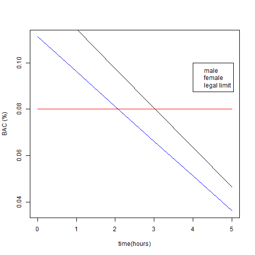

Legal drinking limit calculator
========================================================
author: Molu Shi
date: Sun Oct 25 16:54:23 2015

Legal drinking limit
========================================================

The legal drinking limit is defined by the blood alcohol content (BAC) below 0.08%, where $BAC$ can be estimated as 

$$BAC = \frac{0.806 \cdot SD \cdot 1.2}{BW \cdot Wt} - MR \cdot DP$$

- SD: Number of standard drinks consumed
- BW: Body water constant  (0.58 for men and 0.49 for women)
- Wt: Body weight measured in Kg
- MR: Alcohol metabolism rate (0.015 for men and 0.017 for women)
- DP: Drinking period in hours.


BAC male vs female
========================================================
Blood alcohol metabolism over time
- $Wt$ = 75 Kg,  $SD$ = 5


```r
t <- 0:5; Wt <- 75; limit <- rep(0.08,length(t))
BAC_m <- 0.806*5*1.2/(0.58*Wt) - 0.015*t
BAC_f <- 0.806*5*1.2/(0.49*Wt) - 0.017*t
```
 


BAC calculator 
========================================================
- Goal: quick estimate of allowed standard drinks/hour, to assist both costumers and restaurant staff.
- Input: age, body weight, gender
- Output: number of allowed standard drinks consumption per hour
- Standard drinks: Beverage containing 0.6 US fl oz (18 ml) of ethanol, e.g. 
* 80 proof liquor: One shot (1.5 Oz)
* Table wine: One glass (5 Oz)
* Beer: One can/bottle (12 Oz)

BAC calculator example
========================================================

- Age: 30, female, 75 kg,
- Legal drinking limit (standard drinks per hour):

$$ SD = [0.08 + 0.017\cdot 1]\frac{0.49 \cdot 75}{0.8066 \cdot 1.2} = 3.6 \simeq 3$$
